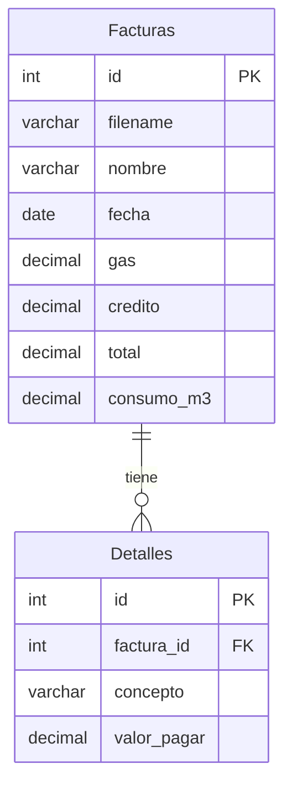
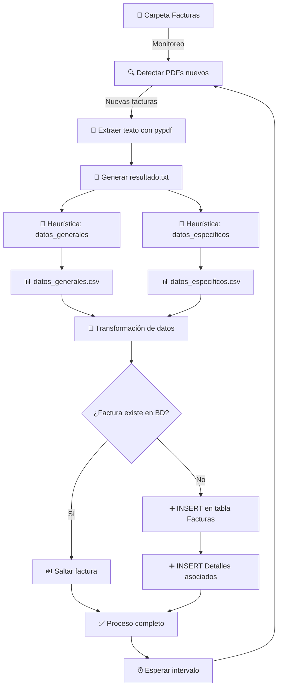

# 📊 Sistema ETL para Procesamiento de Facturas

## 🎯 Descripción del Proyecto

Este proyecto implementa un **sistema completo de ETL (Extract, Transform, Load)** para procesar facturas en formato PDF de manera automática. El sistema extrae información clave de las facturas, transforma los datos en un formato estructurado y los carga en una base de datos MySQL para su análisis y consulta.

✅ Extracción automatizada de datos desde PDFs

✅ Procesamiento de texto con técnicas heurísticas

✅ Transformación y normalización de datos

✅ Diseño e implementación de bases de datos relacionales

✅ Optimización de consultas y carga de datos

✅ Automatización de procesos con Python

---

## 📁 Estructura del Proyecto

```
ETL_FACTURAS/
│
├── main.py                    # Orquestador principal del sistema
├── analisis_general.py        # Extractor de datos generales (heurística)
├── analisis_especifico.py     # Extractor de datos específicos (ítems)
├── conexion.py                # Gestión de conexiones y operaciones SQL
├── corregir_cargar.py         # Procesamiento y carga optimizada a BD
├── requirements.txt           # Dependencias del proyecto
│
└── Facturas/                  # Carpeta de trabajo
    ├── *.pdf                  # Facturas en PDF (entrada)
    ├── resultado.txt          # Texto extraído consolidado
    ├── datos_generales.csv    # Datos principales de facturas
    └── datos_especificos.csv  # Detalles/ítems de cada factura
```

---

## 🔧 Requisitos Previos

### Dependencias de Python

Instalar las bibliotecas necesarias:

```bash
pip install -r requirements.txt
```

**Librerías utilizadas:**

- `pdfplumber` - Extracción avanzada de texto desde PDFs
- `pypdf` - Lectura de documentos PDF
- `pymupdf` - Soporte adicional para PDFs complejos
- `mysql-connector-python` - Conexión con MySQL
- `python-dotenv` - Gestión de variables de entorno

### Base de Datos MySQL

1. Crear una base de datos MySQL

## 🚀 Cómo Ejecutar el Proyecto

### Ejecución Continua (Modo Monitoreo)

El sistema monitorea la carpeta `Facturas/` cada 30 segundos:

```bash
python main.py
```

### Ejecución Única (Modo Prueba)

Procesa las facturas una sola vez y termina:

```bash
python main.py --once
```

### Cambiar Intervalo de Monitoreo

```bash
python main.py --interval 60  # Monitorea cada 60 segundos
```

---

## 📖 Proceso ETL Detallado

### 1️⃣ **EXTRACCIÓN DE DATOS**

#### 🎯 Metodología: Heurística Inteligente

El sistema **NO** depende de plantillas fijas. En su lugar, utiliza **técnicas heurísticas** para extraer datos de facturas con formatos variables.

#### 📄 Archivo: `analisis_general.py`

**Función Principal:** `leer_pdfs_y_guardar_txt()`

**¿Qué hace?**

- Lee todos los archivos PDF de la carpeta `Facturas/`
- Utiliza la librería `pypdf` para extraer texto plano
- Genera un archivo consolidado `resultado.txt` con todo el texto extraído
- Separa cada factura con delimitadores `----- nombre_archivo.pdf -----`

**Heurística Aplicada:**

La función `parse_resultado_y_guardar_csv()` implementa múltiples estrategias para extraer campos clave:

**🔹 Extracción del Nombre:**

```python
# 5 niveles de heurística progresiva:
1. Buscar línea con MAYÚSCULAS, varias palabras, sin números/símbolos
2. Si falla, buscar línea sin números pero con símbolos permitidos
3. Separar fechas si aparecen junto al nombre
4. Filtrar palabras genéricas (FECHA, PAGO, TOTAL, etc.)
5. Fallback: primera línea con mínimo 2 palabras
```

**🔹 Extracción de Fecha:**

```python
# Expresión regular para detectar fechas en formato DD/MM/YYYY
date_re = re.compile(r'(\d{1,2}/\d{1,2}/\d{4})')
```

**🔹 Extracción de Montos (Gas, Crédito, Total):**

```python
# Estrategia 1: Buscar línea con múltiples montos juntos
# Estrategia 2: Extraer montos en orden del encabezado
# Estrategia 3: Buscar palabra clave "total" o "valor a pagar"
# Formato detectado: $ 26,815  o  $26.815
amount_re = re.compile(r'\$\s*[\d\.,]+')
```

**🔹 Extracción de Consumo (m³):**

```python
# Buscar número entero standalone después del Total
# Rango válido: entre 1 y 5000 m³
# Si no se encuentra, buscar desde el final del documento
standalone_int_re = re.compile(r'^\s*(\d{1,5})\s*$')
```

**Ventajas de la Heurística:**

- ✅ **Flexible:** Funciona con diferentes formatos de factura
- ✅ **Robusta:** Múltiples estrategias de fallback
- ✅ **Inteligente:** Se adapta a variaciones en el texto
- ✅ **Escalable:** Fácil de ajustar para nuevos formatos

---

#### 📄 Archivo: `analisis_especifico.py`

**Función Principal:** `parse_resultado_y_guardar_especifico()`

**¿Qué hace?**

- Extrae los **ítems detallados** de cada factura
- Identifica conceptos y valores a pagar línea por línea

**Heurística para Detalles:**

```python
# Patrón de ítem:
# ÍNDICE (1-2 dígitos) | ID (3-4 dígitos o 'N') | Concepto | ValorFacturado | ValorPagar
item_re = re.compile(r'^\s*(\d{1,2})\s+([0-9]{3,4}|N)\s+(.+?)\s+([0-9\.,]+)\s+([0-9\.,]+)')
```

**Estrategia de Extracción:**

1. Buscar línea que comience con `1 ` (primer ítem)
2. Continuar extrayendo líneas consecutivas con índice numérico
3. Separar: Índice, ID, Concepto, Montos
4. Tomar segundo monto como "Valor a Pagar"
5. Si segundo monto es 0 pero primero no, usar absoluto del primero
6. Normalizar montos eliminando símbolos y puntuación

**Validaciones:**

- ⚠️ Detener si índice > 99 (evitar capturar años u otros números)
- ⚠️ Filtrar líneas vacías o sin formato válido
- ⚠️ Limpiar valores: `36,156` → `36156`

---

### 2️⃣ **CREACIÓN DE ARCHIVOS CSV**

#### 📊 CSV 1: `datos_generales.csv`

Contiene información principal de cada factura:

| Campo      | Descripción                    | Ejemplo    |
| ---------- | ------------------------------- | ---------- |
| filename   | Nombre normalizado del archivo  | 2024-01    |
| Nombre     | Nombre del titular (2 palabras) | JUAN PEREZ |
| Fecha      | Fecha de emisión               | 15/03/2024 |
| Gas        | Cargo por consumo de gas        | 26815      |
| credito    | Cargo adicional/crédito        | 15000      |
| Total      | Valor total a pagar             | 41815      |
| Consumo_m3 | Consumo en metros cúbicos      | 45         |

**Generación:**

```python
# Sobrescribe el archivo completo en cada ejecución
# Esto garantiza consistencia y evita duplicados
parse_resultado_y_guardar_csv(CARPETA_FACTURAS, 'resultado.txt', 'datos_generales.csv')
```

#### 📊 CSV 2: `datos_especificos.csv`

Contiene los detalles/ítems de cada factura:

| Campo      | Descripción                   | Ejemplo             |
| ---------- | ------------------------------ | ------------------- |
| filename   | Nombre normalizado del archivo | 2024-01             |
| ID         | Código del concepto           | 1045                |
| Concepto   | Descripción del cargo         | Consumo Gas Natural |
| ValorPagar | Valor del ítem                | 26815               |

**Generación:**

```python
# También sobrescribe en cada ejecución
# Extrae múltiples ítems por factura
parse_resultado_y_guardar_especifico(CARPETA_FACTURAS, 'resultado.txt', 'datos_especificos.csv')
```

**Conocimiento Adquirido:**

- 📚 Manejo de archivos CSV con Python (`csv.DictWriter`)
- 📚 Normalización de datos (conversión de formatos)
- 📚 Estrategias de escritura: sobrescritura vs. append
- 📚 Validación y limpieza de datos antes de guardar

---

### 3️⃣ **TRANSFORMACIÓN DE DATOS**

#### 🔄 Normalizaciones Aplicadas

**1. Normalización de Nombres de Archivo:**

```python
# Ejemplo:
# Entrada:  "Factura_Marzo_2024_001.pdf"
# Proceso:  Tomar últimos 7 caracteres del nombre base
# Salida:   "2024-01"
original_filename = row['filename']
base_name = original_filename.rsplit('.', 1)[0]  # Eliminar extensión
new_filename = base_name[-7:]  # Últimos 7 caracteres
```

**2. Normalización de Nombres de Personas:**

```python
# Limitar a 2 primeras palabras para estandarización
nombre_completo = "JUAN CARLOS PEREZ RODRIGUEZ"
palabras = nombre_completo.split()
nombre_corto = ' '.join(palabras[:2])  # "JUAN CARLOS"
```

**3. Conversión de Fechas:**

```python
# Formato CSV:     "15/03/2024" (DD/MM/YYYY)
# Formato BD:      "2024-03-15" (YYYY-MM-DD para MySQL DATE)
fecha_bd = datetime.datetime.strptime(row['Fecha'], '%d/%m/%Y').strftime('%Y-%m-%d')
```

**4. Normalización de Montos:**

```python
# Entrada:  "$ 26,815" o "$26.815"
# Limpieza: Eliminar $, espacios, puntos y comas
# Salida:   "26815" (solo dígitos)
clean_amount = re.sub(r'[^0-9]', '', monto_original)
```

**Conocimiento Adquirido:**

- 📚 Uso de expresiones regulares (`re`) para limpieza de datos
- 📚 Conversión entre formatos de fecha con `datetime`
- 📚 Transformación de strings: `split()`, `join()`, `strip()`
- 📚 Validación de tipos de datos antes de carga

---

### 4️⃣ **USO DE SQL Y BASE DE DATOS**

#### 🗄️ Archivo: `conexion.py`

**Función:** Gestiona todas las operaciones con MySQL

#### 📐 Diseño de la Base de Datos

**Tabla 1: `Facturas`** (Información General)

```sql
cCREATE TABLE Facturas (
    id INT AUTO_INCREMENT PRIMARY KEY,
    filename VARCHAR(50),          -- Identificador único normalizado
    nombre VARCHAR(255),           -- Nombre del titular
    fecha DATE,                    -- Fecha de emisión
    gas DECIMAL(10,2),            -- Cargo por gas
    credito DECIMAL(10,2),        -- Cargo credito
    total DECIMAL(10,2),          -- Total a pagar
    consumo_m3 DECIMAL(10,2)      -- Consumo en metros cúbicos
);
```

**Tabla 2: `Detalles`** (Ítems Específicos)

```sql
CREATE TABLE Detalles (
    id INT AUTO_INCREMENT PRIMARY KEY,
    factura_id INT,                -- Relación con tabla Facturas
    concepto VARCHAR(255),         -- Descripción del ítem
    valor_pagar DECIMAL(10,2),    -- Valor del ítem
    FOREIGN KEY(factura_id) REFERENCES Facturas(id)
);
```

**Relación:** Una factura puede tener múltiples detalles (relación 1:N)



---

#### 🔌 Conexión a la Base de Datos

```python
def create_connection():
    """Crea conexión segura usando variables de entorno"""
    host = os.getenv('DB_HOST')
    database = os.getenv('DB_NAME')
    user = os.getenv('DB_USER')
    password = os.getenv('DB_PASSWORD')
  
    # Validación antes de conectar
    if not all([host, database, user, password]):
        raise ValueError("Faltan variables de entorno")
  
    connection = mysql.connector.connect(
        host=host,
        database=database,
        user=user,
        password=password
    )
    return connection
```

**Buenas Prácticas Aplicadas:**

- ✅ Variables de entorno (seguridad)
- ✅ Validación de credenciales
- ✅ Manejo de excepciones

---

#### 📥 Operaciones SQL - INSERCIÓN

**1. Insertar Factura:**

```python
def insert_factura(conn, filename, nombre, fecha, gas, credito, total, consumo_m3):
    cursor = conn.cursor(buffered=True)
    try:
        cursor.execute(
            "INSERT INTO Facturas VALUES (NULL, %s, %s, %s, %s, %s, %s, %s)",
            (filename, nombre, fecha, gas, credito, total, consumo_m3)
        )
        factura_id = cursor.lastrowid  # Obtener ID generado
        conn.commit()
        return factura_id
    finally:
        cursor.close()
```

**2. Insertar Detalles:**

```python
def insert_detalles(conn, factura_id, concepto, valor_pagar):
    cursor = conn.cursor(buffered=True)
    try:
        cursor.execute(
            "INSERT INTO Detalles VALUES (NULL, %s, %s, %s)",
            (factura_id, concepto, valor_pagar)
        )
        conn.commit()
    finally:
        cursor.close()
```

**Seguridad:**

- ✅ Uso de consultas parametrizadas (`%s`) para prevenir SQL Injection
- ✅ `cursor.close()` en bloque `finally` para liberar recursos
- ✅ `conn.commit()` para confirmar transacciones

---

#### 🔍 Operaciones SQL - CONSULTAS

**1. Obtener Factura por Filename:**

```python
def get_factura_id_by_filename(conn, filename):
    cursor = conn.cursor(buffered=True)
    try:
        cursor.execute("SELECT id FROM Facturas WHERE filename = %s", (filename,))
        result = cursor.fetchone()
        return result[0] if result else None
    finally:
        cursor.close()
```

**2. Obtener Todos los Filenames (Optimización):**

```python
def get_all_filenames(conn):
    """Obtiene todos los filenames de una sola vez"""
    cursor = conn.cursor(buffered=True)
    try:
        cursor.execute("SELECT filename FROM Facturas")
        results = cursor.fetchall()
        # Retorna un set para búsqueda O(1)
        return {row[0] for row in results}
    finally:
        cursor.close()
```

**3. Verificar Existencia de Detalle:**

```python
def check_detalle_exists(conn, factura_id, concepto, valor_pagar):
    cursor = conn.cursor(buffered=True)
    try:
        cursor.execute(
            "SELECT id FROM Detalles WHERE factura_id = %s AND concepto = %s AND valor_pagar = %s",
            (factura_id, concepto, valor_pagar)
        )
        result = cursor.fetchone()
        return result is not None
    finally:
        cursor.close()
```

---

#### ⚡ CARGA OPTIMIZADA A LA BASE DE DATOS

#### 📄 Archivo: `corregir_cargar.py`

**Problema Original:**

- ❌ El sistema cargaba TODAS las facturas cada vez
- ❌ Generaba duplicados en la base de datos
- ❌ Proceso extremadamente lento

**Solución Implementada:**

**1. Carga Optimizada de Facturas Generales:**

```python
def process_generales(conn, file_path):
    # 1. Obtener todos los filenames existentes en BD (1 consulta)
    existing_filenames = get_all_filenames(conn)
  
    # 2. Leer CSV
    with open(file_path, 'r') as f:
        reader = csv.DictReader(f)
        for row in reader:
            # 3. Normalizar filename
            original_filename = row['filename']
            base_name = original_filename.rsplit('.', 1)[0]
            new_filename = base_name[-7:]
          
            # 4. Verificar si ya existe (búsqueda O(1) en set)
            if new_filename in existing_filenames:
                continue  # Saltar factura existente
          
            # 5. Insertar solo facturas nuevas
            factura_id = insert_factura(conn, new_filename, ...)
```

**2. Carga Optimizada de Detalles:**

```python
def process_especificos(conn, file_path):
    # 1. Obtener filenames existentes
    existing_filenames = get_all_filenames(conn)
  
    # 2. Caché para factura_ids (evitar consultas repetidas)
    filename_to_id = {}
  
    with open(file_path, 'r') as f:
        reader = csv.DictReader(f)
        for row in reader:
            new_filename = ...
          
            # 3. Solo procesar detalles de facturas existentes
            if new_filename not in existing_filenames:
                continue
          
            # 4. Usar caché de IDs
            if new_filename not in filename_to_id:
                factura_id = get_factura_id_by_filename(conn, new_filename)
                filename_to_id[new_filename] = factura_id
            else:
                factura_id = filename_to_id[new_filename]
          
            # 5. Verificar duplicados antes de insertar
            if not check_detalle_exists(conn, factura_id, concepto, valor):
                insert_detalles(conn, factura_id, concepto, valor)
```

**Optimizaciones Aplicadas:**

| Técnica                        | Beneficio                              |
| ------------------------------- | -------------------------------------- |
| Set para filenames existentes   | Búsqueda O(1) vs O(n) consultas SQL   |
| Caché de factura_ids           | Evita consultas repetidas              |
| Verificación antes de insertar | Previene duplicados                    |
| Consulta masiva inicial         | 1 consulta vs n consultas individuales |
| Contadores de progreso          | Visibilidad del proceso                |

**Resultado:**

- ✅ M**ás rápido** que el enfoque original
- ✅ Sin duplicados en la base de datos
- ✅ Carga incremental (solo nuevos registros)

---

## 🧠 Conocimientos Técnicos 

### 📚 Python Avanzado

- ✅ Procesamiento de archivos PDF (`pypdf`, `pdfplumber`)
- ✅ Expresiones regulares (`re`) para extracción de datos
- ✅ Manejo de CSV con `csv.DictReader` y `csv.DictWriter`
- ✅ Gestión de variables de entorno (`python-dotenv`)
- ✅ Manejo de fechas y tiempos (`datetime`)
- ✅ Argumentos de línea de comandos (`argparse`)
- ✅ Estructuras de datos eficientes (sets, diccionarios)

### 🗄️ Bases de Datos y SQL

- ✅ Diseño de esquemas relacionales (normalización)
- ✅ Creación y gestión de tablas (`CREATE TABLE`)
- ✅ Relaciones entre tablas (`FOREIGN KEY`)
- ✅ Consultas parametrizadas (prevención SQL Injection)
- ✅ Manejo de transacciones (`commit`)
- ✅ Optimización de consultas (reducir llamadas a BD)
- ✅ Uso de índices implícitos (`PRIMARY KEY`)

### 🔄 ETL y Procesamiento de Datos

- ✅ Extracción: Técnicas heurísticas vs. templates fijos
- ✅ Transformación: Normalización y limpieza de datos
- ✅ Carga: Estrategias incrementales y optimizadas
- ✅ Validación de datos en múltiples etapas
- ✅ Manejo de errores y excepciones

### 🏗️ Arquitectura de Software

- ✅ Separación de responsabilidades (módulos independientes)
- ✅ Reutilización de código (funciones modulares)
- ✅ Patrón de procesamiento por lotes (batch processing)
- ✅ Sistema de monitoreo continuo (polling)
- ✅ Logging y trazabilidad de operaciones

### ⚡ Optimización y Performance

- ✅ Reducción de consultas SQL (N+1 queries problem)
- ✅ Uso de caché en memoria (diccionarios)
- ✅ Estructuras de datos eficientes (sets para búsquedas)
- ✅ Procesamiento incremental vs. completo
- ✅ Contadores de rendimiento

### 🔒 Seguridad

- ✅ Variables de entorno para credenciales sensibles
- ✅ Consultas parametrizadas (SQL Injection prevention)
- ✅ Validación de datos de entrada
- ✅ Manejo seguro de archivos

---

## 📊 Flujo Completo del Sistema



---

## 🎓 Casos de Uso

### Ejemplo 1: Nueva Factura Detectada

```bash
[Mon Nov 27 01:00:00 2024] Se detectaron 1 facturas nuevas: ['Factura_2024_11.pdf']
[Mon Nov 27 01:00:01 2024] CSVs actualizados: Facturas/datos_generales.csv, Facturas/datos_especificos.csv

[Mon Nov 27 01:00:02 2024] === Iniciando carga optimizada a base de datos ===
Facturas existentes en BD: 45
✓ Insertada factura 46 - 2024-11 (CARLOS RODRIGUEZ)
✓ Insertado detalle para factura 46: Consumo Gas Natural
✓ Insertado detalle para factura 46: Subsidio
✓ Insertado detalle para factura 46: Intereses Brilla

--- Resumen process_generales ---
Facturas ya existentes (saltadas): 0
Facturas nuevas insertadas: 1

--- Resumen process_especificos ---
Detalles ya existentes (saltados): 0
Detalles nuevos insertados: 3
```

### Ejemplo 2: Ejecución Sin Facturas Nuevas

```bash
[Mon Nov 27 01:00:30 2024] No hay facturas nuevas. Procesados: 46
```

---

## 🛠️ Solución de Problemas

### Error: "Faltan variables de entorno"

**Solución:** Crear archivo `.env` con credenciales:

```env
DB_HOST=localhost
DB_NAME=facturas_db
DB_USER=root
DB_PASSWORD=tu_contraseña
```

### Error: "No se encontraron archivos PDF"

**Solución:** Verificar que los archivos estén en `Facturas/` y tengan extensión `.pdf`

### Error: MySQL Connection Failed

**Solución:**

1. Verificar que MySQL esté ejecutándose
2. Validar credenciales en `.env`
3. Confirmar que la base de datos existe

### CSVs con datos incorrectos

**Solución:**

- Revisar formato de las facturas PDF
- Ajustar expresiones regulares en `analisis_general.py`
- Ejecutar con `--once` para depuración

---

## 📝 Próximas Mejoras

- [ ] Interfaz web para visualización de datos
- [ ] Gráficos de consumo histórico
- [ ] Alertas por consumo anormal
- [ ] Export a Excel/PDF de reportes
- [ ] API REST para consultas
- [ ] Machine Learning para predicción de consumos

---

## 👨‍💻 Autor

Proyecto desarrollado como demostración de:

- Procesamiento de datos con Python
- Diseño e implementación de sistemas ETL
- Optimización de bases de datos
- Automatización de procesos

---

## 📄 Licencia

Este proyecto es de código abierto y está disponible para fines educativos.

---

**¡Gracias por revisar este proyecto!** 🚀
